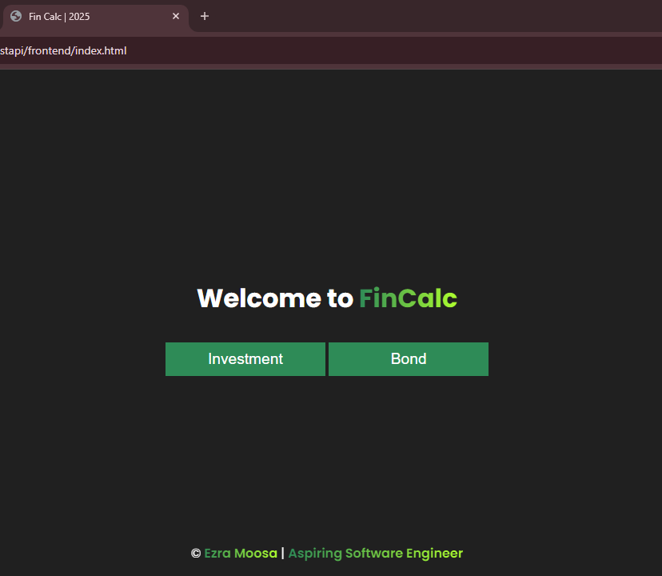
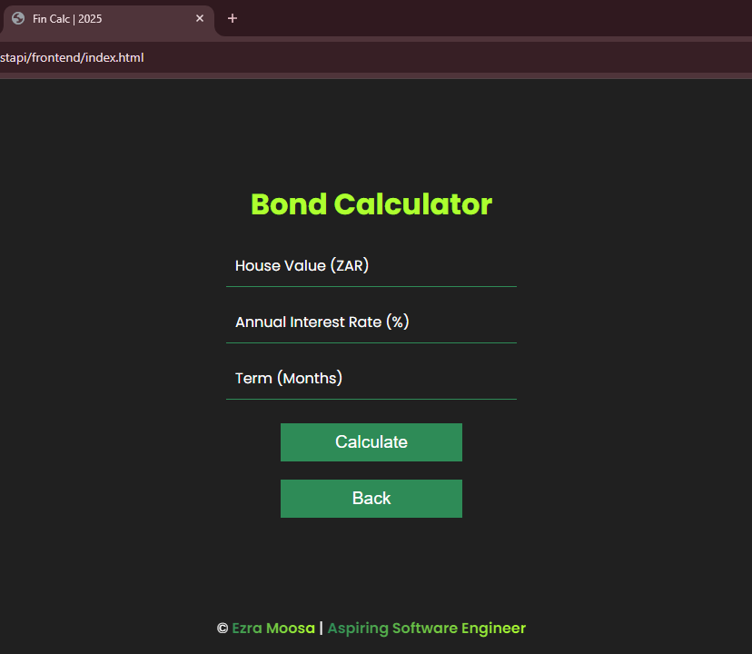

# 📊 Full-Stack Finance Calculator (FastAPI)

A simple finance calculator built with **HTML, CSS, JavaScript, and FastAPI** to compute **investment growth** and **bond repayments**. 🚀  

## 🌟 Features
✅ Choose between **Investment** or **Bond** calculations  
✅ Enter financial details and get instant results  
✅ Simple, clean, and responsive UI 🎨 
✅ FastAPI backend for accurate calculations ⚡  

## 🛠️ Technologies Used
- 🌐 **Frontend:** HTML, CSS, JavaScript  
- 🚀 **Backend:** FastAPI (Python)  

## 🚀 How to Run the Project

### 1️⃣ Start the Backend
Make sure you have **Python** installed. Then run:  
```sh
cd backend
pip install -r requirement.txt
uvicorn main:app --reload
```
Your FastAPI server will run at http://127.0.0.1:8000

### 2️⃣ Start the Frontend
Simply open index.html in a browser, or use Live Server/ Preview in VS Code.

🎯 Usage
1. Select Investment or Bond
2. Enter your details and click Calculate
3. View the result instantly 📈

📸 Screenshots
  

Made with ❤️ by [Ezra](https://github.com/EzraMoosa) 🚀
